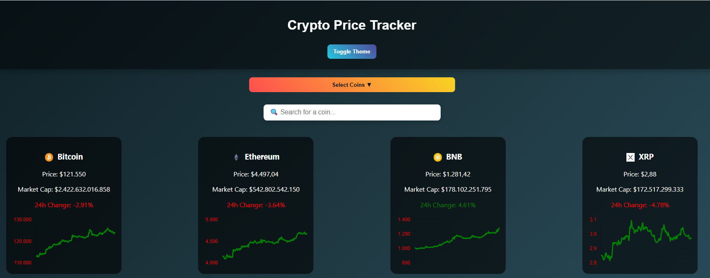

# Crypto Price Tracker

A web application to track live cryptocurrency prices with interactive charts and search functionality.



## Features
- Display top cryptocurrencies by market cap
- Search for specific coins
- Theme toggle (dark/light)
- Responsive design for all devices
- Interactive price charts with Chart.js

## Technologies
- HTML5, CSS3, JavaScript
- Chart.js
- CoinGecko API

## Usage
1. Clone the repository:
   ```bash
   git clone https://github.com/NickDgit/project-crypto.git
   ```
2. Open `index.html` in your browser.
3. Use the dropdown to select coins and see live charts.
4. Toggle the theme using the button at the top.

## Contact
- GitHub: NickDgit
- Email: nickdougias@outlook.com


